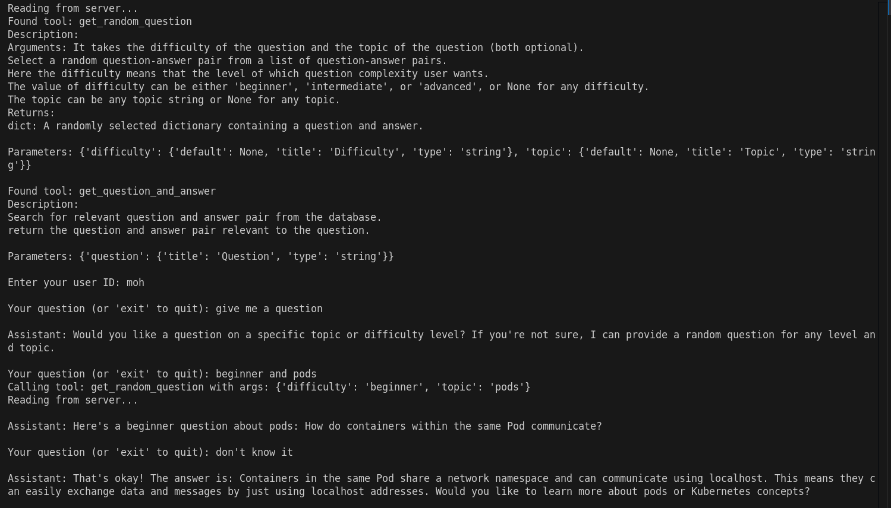

# 🧠 Exam-BOT (MCP-Based AI Agent for LF Certificate Prep)

A prototype AI agent built using the **Model Context Protocol (MCP)** to assist students preparing for **Linux Foundation (LF) certifications** through interactive practice questions and intelligent Q&A responses.

---

Here is the demo video of bot in action: 
https://www.loom.com/share/5ee6606c85bf4af89db3f2c949be22b7?sid=fe4c0d9b-71b7-4bbb-add8-436bba2e0c93
## 🚀 Project Overview

This project serves as an intelligent study companion leveraging **open-source Large Language Models (LLMs)** and **MCP servers** to provide an engaging and interactive learning experience. The agent supports:

- Random practice questions
- Semantic search of relevant Q&A pairs
- Guided conversation for deeper understanding

---

ScreenShots of the bot in action


 ### **Here in the above image, you can see that the bot is asking the user about the complexity level of question he wants to practice. The bot is also asking the topic he wants to prepare.** 

### **In this way the practicing for the exam becomes more personal and engaging.**
## 🏗️ Architecture

The system is composed of several core components:

- **MCP Server (`main.py`)**  
  Handles question retrieval via defined MCP functions.

- **Vector Database (Qdrant)**  
  Stores text embeddings for efficient semantic search.

- **LLM Integration (`llm.py`)**  
  Interfaces with OpenAI-compatible APIs to manage conversation flow.

- **Question Database**  
  A collection of text-based Q&A pairs focused on mining and technical certification topics.

---

## ✨ Features

### Core Workflows

#### 📌 Workflow 1: Question Search
1. User asks a specific question.
2. LLM invokes the `get_question_and_answer()` MCP function.
3. The system searches the Qdrant vector database for relevant Q&A pairs.
4. The LLM provides a contextual, helpful response based on the findings.

#### 🎯 Workflow 2: Practice Mode
1. User requests a practice question.
2. LLM invokes the `get_random_question()` MCP function.
3. The system returns a random Q&A pair.
4. The LLM presents the question and guides the user's learning.

---

## 🛠️ Technical Stack

- **Python 3.x**
- **FastMCP** – MCP server framework
- **Qdrant** – Vector database for semantic search
- **SentenceTransformers** – Text embedding generation
- **LLama3** Run the LLAMAEDGE api server locally. 
    
    for running the model that i have used for this project.
    ```bash
    curl -LO https://huggingface.co/tensorblock/Llama-3-Groq-8B-Tool-Use-GGUF/resolve/main/Llama-3-Groq-8B-Tool-Use-Q5_K_M.gguf
   ```
   then run 
   ```bash
   wasmedge --dir .:. --nn-preload default:GGML:AUTO:Llama-3-Groq-8B-Tool-Use-Q5_K_M.gguf \
   llama-api-server.wasm \
   --prompt-template groq-llama3-tool  --log-all \
   --ctx-size 2048 \
   --model-name llama3
   ```

  
- **JSON** – Data storage format

---
## 📁 Project Structure
```
.
├── .gitignore
├── README.md
├── database
│ └── monogodb.py
├── dataset
│ ├── dataPrep.py # logic for extracting mining dataset
│ ├── file.json
│ ├── kubernetes_basic.json
│ ├── kubernetes_qa.csv # kubernetes dataset
│ ├── mining_qa_pairs.csv # metal mining dataset
│ ├── url_data_fit.py
│ └── url_scrap.py # scrap data from url
├── encoder
│ └── encoder.py # encoder model
├── utils
│ ├── data.py
│ └── ques_select.py # logic to search questions from the vector database
├── vectorstore
│ └── qdrant.py # used for converting q&a pairs to vector embeddings.
├── llm.py # It contains the logic of LLM and tools
├── main.py # contains the mcp tools and their descriptions.
├── rust_qa.txt        
```
---
## 🚀 Setup Instructions
### Prerequisites
- Qdrant VectorStore
```bash
docker run -p 6333:6333 qdrant/qdrant
```
- Python Dependencies
```bash
pip install -r requirements.txt
```
- Environment Variables Create a .env file:
```bash
OPENAI_API_KEY = "" # you can keep it empty
```

## 🔧 MCP Functions

### `get_random_question()`
- **Purpose**: Returns a random Q&A pair from the dataset  
- **Use Case**: Practice mode – presents questions for self-testing  
- **Returns**: `dict` with `question` and `answer`

---

### `get_question_and_answer(question: str)`
- **Purpose**: Searches for relevant Q&A pairs using semantic similarity  
- **Use Case**: Query mode – finds answers to specific questions  
- **Returns**: `list` of top 3 matching Q&A pairs with similarity scores

## 🔮 Future Enhancements

 
- **Expanded Datasets**: Add more LF certification topics  
- **Advanced Analytics**: Track learning progress and weak areas  
- **Multi-modal Support**: Include diagrams and visual aids  

---

## 🤝 Contributing

1. Fork the repository  
2. Create your feature branch:  
   ```bash
   git checkout -b feature/amazing-feature
   ```
3. Add your Q&A datasets in the specified format
4. Test your changes with the MCP server
5. Submit a pull request
---

